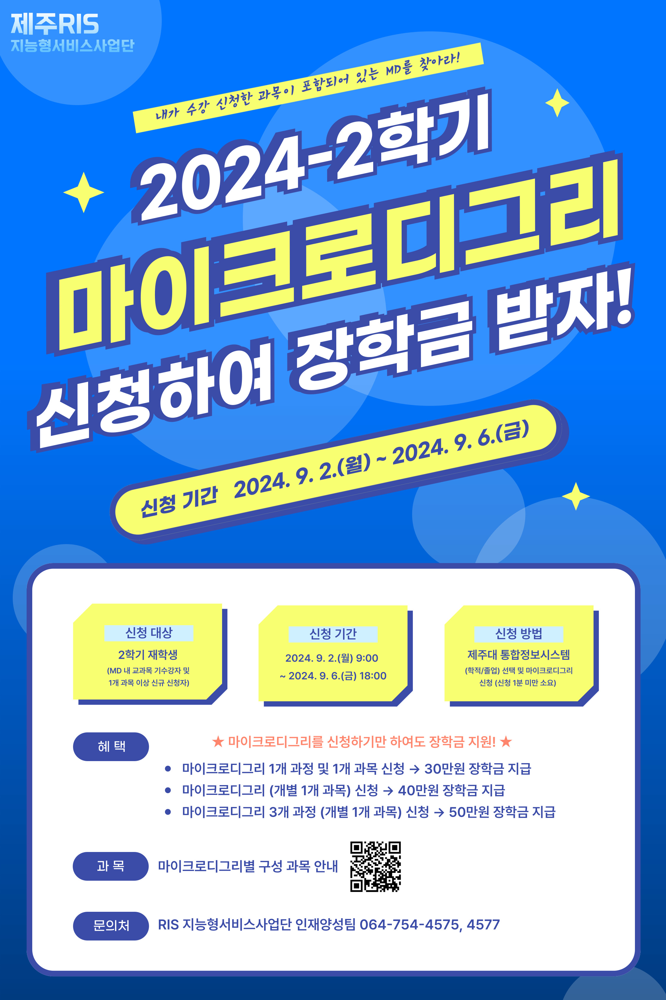
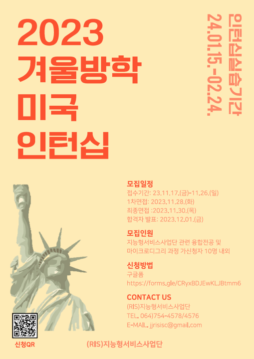

# 인공지능(Artificial Intelligence)

<!-- 주석
## 워크샵 안내

-->



### 자율주행 자동차 경진대회 참여 혜택
* 참여하는 학생들에게는 1천만원 상당의 자율주행 자동차를 구입하여 사용할 수 있도록 지원
* 1인당 장학금 40만원 추가로 지급 예정 


### 구글 클라우드 특강 혜택
* 제주대학교 졸업 2년 이내 학생에게는 혁신인재지원금 50만원 지급  -> 수료 후 일괄지급 
* 전체 수강자 중 3명 선발하여 미국 구글 본사 방문 (예정으로 아직 확정되지 않음)
* 전체 수강자 중 10명 선발하여 상장과 부상 수여
* 제주대학교 재학생 중 3명 선발하여 실리콘벨리 기업 방문, 해외 연수 우선 선발 (2024년도 진행) 


## RIS 지능형서비스사업단 설문조사 (아래 링크 클릭)
http://naver.me/59ijR7PO


## 개인별 분석할 오픈소스 프로젝트 등록 (중간고사 기간까지, 타 학생 등록한 것 중복 선택 불가)
> * https://docs.google.com/spreadsheets/d/1EYto9NcHWAwMuJxJh7oyYzHIr6IuZ9Zn3Y5ZV471g38/edit?usp=sharing

## 강의자료(pdf)
> * [01.인공지능과 머신러닝(예측-분류)](https://github.com/yungbyun/ai/blob/master/01.%EC%9D%B8%EA%B3%B5%EC%A7%80%EB%8A%A5%EA%B3%BC%20%EB%A8%B8%EC%8B%A0%EB%9F%AC%EB%8B%9D(%EC%98%88%EC%B8%A1-%EB%B6%84%EB%A5%98).pdf)
> * [03.파이썬 모듈화_기본](https://github.com/yungbyun/ai/blob/master/03.%ED%8C%8C%EC%9D%B4%EC%8D%AC%20%EB%AA%A8%EB%93%88%ED%99%94_%EA%B8%B0%EB%B3%B8.pdf)

## 동영상 강의 (처음 7개 동영상 시청 필수)
> * 캐글(Kaggle) 소개1, https://www.youtube.com/watch?v=9GWb9yNcsvc&t=112s
> * 캐글(Kaggle) 소개2, https://www.youtube.com/watch?v=VNOYpNItpdI
> * 식물생장예측: https://youtu.be/RKXoSuwuX9I
> * 성별예측: https://www.youtube.com/watch?v=JeYj5OHwQOw
> * 실습(성별예측1): https://youtu.be/QBq2f_1gfZA 
> * 실습(성별예측2): https://youtu.be/4IEbdh62d2Y
> * 실습(식물생장예측): https://youtu.be/DZnpkKxeB-w
> * 실습(모듈화01): https://youtu.be/p6qhjnvTV0k
> * 실습(모듈화02): https://youtu.be/8dpmy2wxxsI
> * 실습(모듈화03): https://youtu.be/zEn7F80J9Ss 
> * 실습(모듈화04): https://youtu.be/YdGYkry6wI4 
> * 실습(모듈화05): https://youtu.be/kA1BcE9iMvA
> * 실습(모듈화06): https://youtu.be/r7o6UiiM1Lc 
> * 실습(모듈화07):https://youtu.be/jFzTmaH0BOI
> * 실습(모듈화08):https://youtu.be/eOiZWL2qTSQ
> * 실습(모듈화09):https://youtu.be/RuI6V-HnA1w
> * 실습(모듈화10):https://youtu.be/GuceU9CTYaQ
> * 실습(모듈화11):https://youtu.be/KzkssBLEFuw
> * 실습(모듈화12): https://youtu.be/L7CxEreBp8I

## (분류) 성별 알아맞히기
> 키/몸무게/발크기로 성별 알아맞추기 <br/>
> * [Female-Male Classification Original](https://www.kaggle.com/code/yungbyun/female-male-classification-original)
> * [함수로 추상화한 코드](https://www.kaggle.com/code/yungbyun/functions-for-ml)
> * [Female-Male Classification With Pycaret](https://www.kaggle.com/code/yungbyun/male-female-classification-with-pycaret/edit)
> * [강의때 작성했던 중간코드 1](https://github.com/yungbyun/ai/blob/master/1018_My.zip)
> * [강의때 작성했던 중간코드 2](https://github.com/yungbyun/ai/blob/master/1018_gildongLib.zip)

## (예측) 식물 생장 예측하기
> 몇일 후 잎의 길이와 너비가 얼마나 자랄 것인지를 예측함. <br/>
> * [Plant Diary Original](https://www.kaggle.com/code/yungbyun/plant-diary-original)
> * [Plant Diary With Pycaret](https://www.kaggle.com/code/yungbyun/plant-diary-with-pycaret/edit)

## (분류) 붓꽃(Iris) 인식
> [Iris Recognition](https://www.kaggle.com/ash316/ml-from-scratch-with-iris)

## (예측) 집값 예측
> https://www.kaggle.com/yungbyun/house-price-prediction-for-tutorial <br/>
> https://www.kaggle.com/yungbyun/house-price-prediction-simple (조금 단순하게) <br/>
> https://www.kaggle.com/code/yungbyun/house-price-prediction (오류 수정)

> **각 모듈에 대한 간단한 설명입니다.**
> * **Pandas 판다스 : 데이터를 읽어들이고 유지하고 관리할 수 있는 멋진 모듈 (데이터베이스에 비유)**
> * **NumPy 넘파이 : 다양한 수치연산, 변환 기능 등을 갖는 멋진 모듈 (계산기에 비유)** 
> * **Seaborn 시본 : 데이터를 멋지게 표시하는 모듈 (엑셀에 비유)** 
> * **sklearn 싸이킷런 : 머신러닝 모델을 만들 수 있는 멋진 모듈 (인공지능 모델 구현)**
## 머신러닝 코드 실행방법
* **Kaggle.com**에서 (https://www.kaggle.com/)
* **Google Colab**으로 (https://colab.research.google.com/)
* 내 PC에 Jupyter Notebook 설치 ('Jupyter Notebook 설치'로 구글/YouTube 검색)
* 내 PC에 **아나콘다(Anaconda)** 를 설치하여 (https://www.anaconda.com/products/distribution)
* 내 PC에 **파이참(PyCharm)** 을 설치하여 (https://www.jetbrains.com/ko-kr/pycharm/download/#section=windows)

## Google Colab을 이용할 경우 구글 드라이브 파일 사용하기
```
from google.colab import drive
drive.mount('/mydrive')

import pandas as pd
df = pd.read_csv("/mydrive/yyy.csv")
df
```

## 주피터 노트북 설치 및 실행 
* 명령 프롬프트에서 아래 명령 실행 
* python -m pip install --upgrade pip
* pip3 install jupyter
* jupyter notebook 

## 캐글 코드를 주피터 노트북에서 실행하고 파이썬 코드로 저장해보기
* 원하는 코드 선택 후 Download code -> 그러면 노트북 코드가 다운로드 됨.
* 데이터 클릭 후 다운로드 -> 그러면 데이터가 다운로드 됨.
* 다운로드된 코드와 데이터를 작업 폴더로 옮기기
* 주피터 노트북에서 실행해보기
* File | Download as | Python (.py) 선택하여 파이썬 코드 다운로드 -> PyCharm에서 실행가능

## 주피터 노트북(**.ipynb)을 파이썬(**.py)으로 바꾸기
* 아나콘다 명령 프롬프트 실행
* jupyter nbconvert --to script filename.ipynb 

